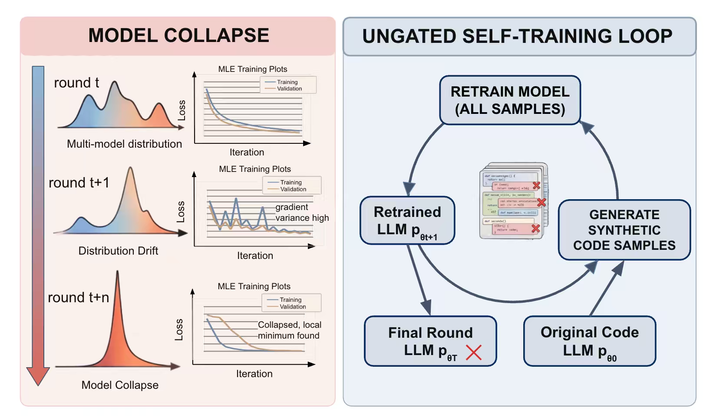
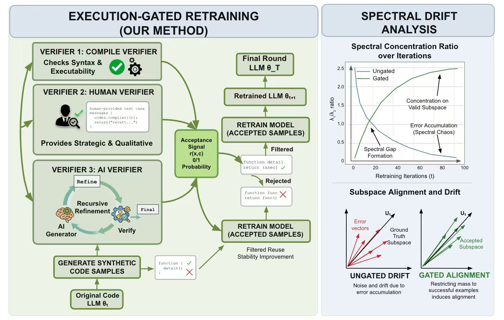

# Gated Retraining for Code LLMs: Studying and Mitigating Model Collapse under Self-Training

This repository contains the full experimental code for studying **model collapse**
in code language models trained iteratively on **their own generated data**
(*self-training* / *self-play*), and for testing whether **gating** the
self-generated data with quality filters mitigates the collapse.

We run a **4 models × 5 filtering strategies** grid of cumulative self-training
experiments and evaluate each round on HumanEval(+), MBPP(+), and LiveCodeBench.

| | |
|---|---|
| **Models** | SantaCoder (1.1B), StarCoder2-3B, Qwen2.5-Coder-1.5B, CodeLlama-7B |
| **Filters** | `none`, `compile`, `quality`, `ppl`, `binary` |
| **Data source** | [The Stack (dedup)](https://huggingface.co/datasets/bigcode/the-stack-dedup), Python subset |
| **Self-play** | take the first 1024 tokens of a file as prompt → generate 1024 tokens → train on it |
| **Loop** | 5 cumulative rounds × 3000 steps (continue training from the previous round's checkpoint) |
| **Evaluation** | [EvalPlus](https://github.com/evalplus/evalplus) (HumanEval+, MBPP+) and [LiveCodeBench](https://github.com/LiveCodeBench/LiveCodeBench), per round |

---

## The core question

> If a model is trained over and over on data it generated itself, does its
> coding ability improve, degrade, or stay flat — and can filtering the
> self-generated data prevent degradation?

### Ungated self-training loop

Without any filtering, generated data is fed straight back into training. Errors
and low-diversity samples accumulate across rounds, driving **model collapse**.



### Gated retraining pipeline

The gated variants insert a **filter** between generation and training. Only
samples that pass the gate are used to retrain the model, which is the proposed
mitigation we ablate across four filter designs.



### The five gates

| Filter | What it keeps |
|--------|---------------|
| `none` | Everything — the ungated baseline (expected to collapse). |
| `compile` | Only samples whose code parses/compiles. |
| `quality` | Compiles **and** passes lightweight quality heuristics (length, non-repetition). |
| `ppl` | Generate 4× the samples, score by the model's own perplexity, keep the lowest-perplexity top 25%. |
| `binary` | Generate 4× the samples, score with a "good vs. bad" binary classifier prompt, keep the top 25%. |

---

## Repository structure

```
gated-code-retraining/
├── README.md
├── LICENSE
├── requirements.txt              # general env (StarCoder2 / Qwen2.5 / CodeLlama)
├── requirements-santacoder.txt   # pinned env (transformers==4.35.2)
├── assets/                       # figures used in this README
├── configs/                      # one YAML per model (HF id, FIM tokens, stop sequences)
│   ├── santacoder.yaml
│   ├── starcoder2.yaml
│   ├── qwen25.yaml
│   └── codellama.yaml
├── src/                          # main (V2) pipeline — all current experiments
│   ├── config.py                 # load model config (YAML → dict)
│   ├── fim.py                    # Fill-in-the-Middle transform (per-model tokens)
│   ├── generate.py               # self-play data generation (+ inline compile/quality filters)
│   ├── filters.py                # ppl / binary scoring and top-k filtering
│   ├── train.py                  # training (ConstantLengthDataset, multi-version transformers)
│   ├── evaluate_evalplus.py      # HumanEval(+) / MBPP(+) generation + scoring
│   ├── evaluate_lcb.py           # LiveCodeBench generation + scoring
│   ├── aggregate_results.py      # merge all CSVs → summary tables + figures
│   ├── status_experiments.py     # progress dashboard across the 4×5 grid
│   ├── run_experiment.sh         # single SLURM entry point for one (model, filter) run
│   └── *.sh                      # smoke tests, probes, batch submitters
├── scripts/                      # earlier (V1) single-model helper scripts, kept for reference
└── docs/
    ├── DESIGN.md                 # full experimental design
    └── PROJECT_SPEC.md           # build-from-scratch specification
```

> `train.py` and `fim.py` at the repository root are the original V1
> (SantaCoder-only) scripts, kept for reference. The canonical, multi-model
> pipeline lives in `src/`.

---

## Installation

### 1. Clone and set up Python environments

SantaCoder requires an **older, pinned** `transformers` (its custom modeling code
breaks on `transformers >= 4.36`), so it gets its own environment. The other three
models share a general environment.

```bash
git clone <your-fork-url> gated-code-retraining
cd gated-code-retraining

# General environment — StarCoder2 / Qwen2.5 / CodeLlama
python3 -m venv venvs/general
source venvs/general/bin/activate
pip install -r requirements.txt
deactivate

# SantaCoder environment (pinned transformers)
python3 -m venv venv
source venv/bin/activate
pip install -r requirements-santacoder.txt
deactivate
```

`run_experiment.sh` activates `venv` for `santacoder` and `venvs/general` for all
other models automatically.

### 2. Clone LiveCodeBench

`src/evaluate_lcb.py` imports `lcb_runner` from a `LiveCodeBench/` directory at the
repository root:

```bash
git clone https://github.com/LiveCodeBench/LiveCodeBench.git LiveCodeBench
# install its dependencies into the general env per the LiveCodeBench README
```

### 3. Configure environment variables

The scripts read everything sensitive/host-specific from the environment, with
sensible fallbacks. Set what applies to your machine:

```bash
export HF_TOKEN=hf_xxx                       # your Hugging Face token (for gated/large models)
export HF_HOME=$HOME/.cache/huggingface      # HF cache (default: $HOME/.cache/huggingface)
export THE_STACK_ARROW_CACHE=/path/to/the-stack-arrow-cache   # optional: local Arrow cache

# Required so `python src/*.py` can import the `src` package:
export PYTHONPATH=$(pwd):$PYTHONPATH
```

If `THE_STACK_ARROW_CACHE` is unset, `generate.py` falls back to streaming
The Stack from the Hub (or pass `--local_dataset_path`).

---

## Quickstart

Run a single (model, filter) experiment for 5 cumulative rounds:

```bash
# Locally (no SLURM):
bash src/run_experiment.sh santacoder none
bash src/run_experiment.sh qwen25 ppl --rounds 5 --max-steps 3000

# On a SLURM cluster:
sbatch src/run_experiment.sh codellama compile
```

`run_experiment.sh MODEL FILTER [options]` is idempotent — it resumes from existing
checkpoints/CSV rows. Key options (see `bash src/run_experiment.sh --help`):

| Option | Default | Meaning |
|--------|---------|---------|
| `--rounds N` | 5 | number of self-training rounds |
| `--num-samples N` | 5000 | training samples kept per round |
| `--max-steps N` | 3000 | training steps per round |
| `--output-root DIR` | `results` | where results/checkpoints are written |
| `--skip-eval` | off | skip EvalPlus + LiveCodeBench (generation/training only) |
| `--eval-limit N` | — | evaluate only the first N tasks (smoke test) |

### What one round does

```
1. Generate         src/generate.py        (+ src/filters.py for ppl/binary)
2. Train            src/train.py           (continue from previous round's checkpoint)
3. Evaluate         src/evaluate_evalplus.py  (HumanEval, MBPP)
                    src/evaluate_lcb.py       (LiveCodeBench)
4. Append a row     results/{model}/{filter}/results.csv
5. Next round uses this round's checkpoint as the base model
```

---

## Reproducing the full grid

```bash
# 4 models × 5 filters = 20 runs
for model in santacoder starcoder2 qwen25 codellama; do
  for filter in none compile quality ppl binary; do
    sbatch src/run_experiment.sh "$model" "$filter"
  done
done

# Check progress across the grid at any time
python src/status_experiments.py

# Aggregate everything into summary tables + figures
python src/aggregate_results.py            # → results/summary/{all_results.csv, *.csv, *.png}
```

Per-model defaults (generation/training batch size, gradient accumulation,
LiveCodeBench workers) are baked into `run_experiment.sh` so the **effective
training batch size stays 64** across models for a fair comparison.

---

## Results schema

Each run appends to `results/{model}/{filter}/results.csv` with a unified schema
so all 20 runs merge cleanly:

```
model, filter, round, steps_total,
humaneval_pass1, humaneval_plus_pass1, mbpp_pass1, mbpp_plus_pass1,
livecodebench_pass1, train_loss,
num_generated, num_after_filter, filter_pass_rate,
generation_time_sec, training_time_sec, eval_time_sec, timestamp
```

`aggregate_results.py` reads these and emits `all_results.csv`, a round-5 summary,
a "collapse speed" table, and per-metric trend figures under `results/summary/`.

---

## Notes & known pitfalls

- **SantaCoder + `transformers >= 4.36`** breaks the KV cache — keep `==4.35.2`.
- **PYTHONPATH** must include the repo root, or `from src.config import ...` fails.
- **ppl / binary filters need a GPU** — they share the generation GPU and run sequentially after generation.
- **EvalPlus** caches `*_eval_results.json`; the code deletes stale files to force re-evaluation.
- See `docs/DESIGN.md` and `docs/PROJECT_SPEC.md` for the complete design rationale, hyperparameters, and per-model details.

---

## Citation

If you use this code, please cite this repository:

```bibtex
@misc{gated-code-retraining,
  title  = {Gated Retraining for Code LLMs: Studying and Mitigating Model Collapse under Self-Training},
  author = {The Authors},
  year   = {2026},
  howpublished = {\url{https://github.com/<your-org>/gated-code-retraining}}
}
```

## License

Released under the [MIT License](LICENSE). The bundled model configs reference
third-party models and datasets (The Stack, EvalPlus, LiveCodeBench, and the
respective base models), which carry their own licenses.
